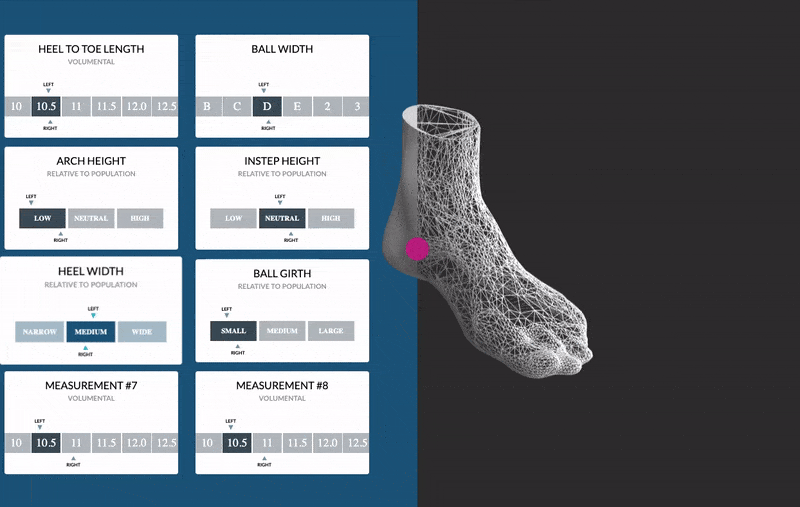

# Volumental Frontend challenge

### `yarn install --frozen-lockfile`

Installs node modules needed to run the app.

### `yarn start`

Runs the app in the development mode.\
Open [http://localhost:3000](http://localhost:3000) to view it in the browser.

The page will reload if you make edits.\
You will also see any lint errors in the console.

___

## Challenge description:

This is an abstract view of the 3d foot model and it's properties shown in widget section on the left.

Your task is to recreate measurements section based on above example using data provided in dummy_mesurement.json file.
It doesn't have to look the same. Use your own judgement when creating micro-animations and styling components.

Make sure to use Typescript when types are critical like React props & state (also in other places you find important)

___

This challenge shouldn't take longer than 4-5 hours.

We will first and foremost look at whether the task was successfully solved.

Beyond that, we will consider:
* Is the application visually appealing?
* Does it offer a good user experience? Is it easy to read, and does it have a nice look and feel?
* How well written is the code? Is it readable? Did you structure the components in a sensible way?
* Did you add your own personal touch? Anything that surprised us? Be creative!

Good luck and have fun!
